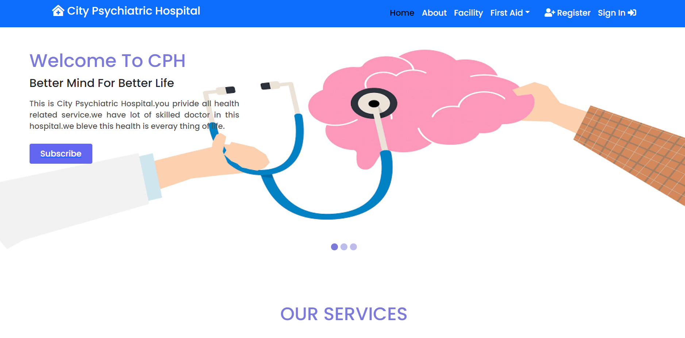

# Simple Page of 'Health Related Service' (City Psyciatric Hospital) - Assignment (Milestone - 10)

* This Assignment is mainly on `React Router` along with `Firebase`.

* `Custom 404 Error Page` added for concern.

* As a Basic `Private Route` Assignment , We had to Put many Routes .

* `Google and Email Authentication` system applied through `Firebase`

* Basic `Banner` is added as well. 

* [Click Here for Live Link / Website  (Netlify)](https://www.netlify.app/)

* Screenshot of Live Site -

### Technology Used

* Google Firebase
* React JS
* React Router
* Google Crome Developer Tool
* Custom JSON
* React Bootstrap
* JavaScript (ES6)
* Fontawesome 6 Beta
